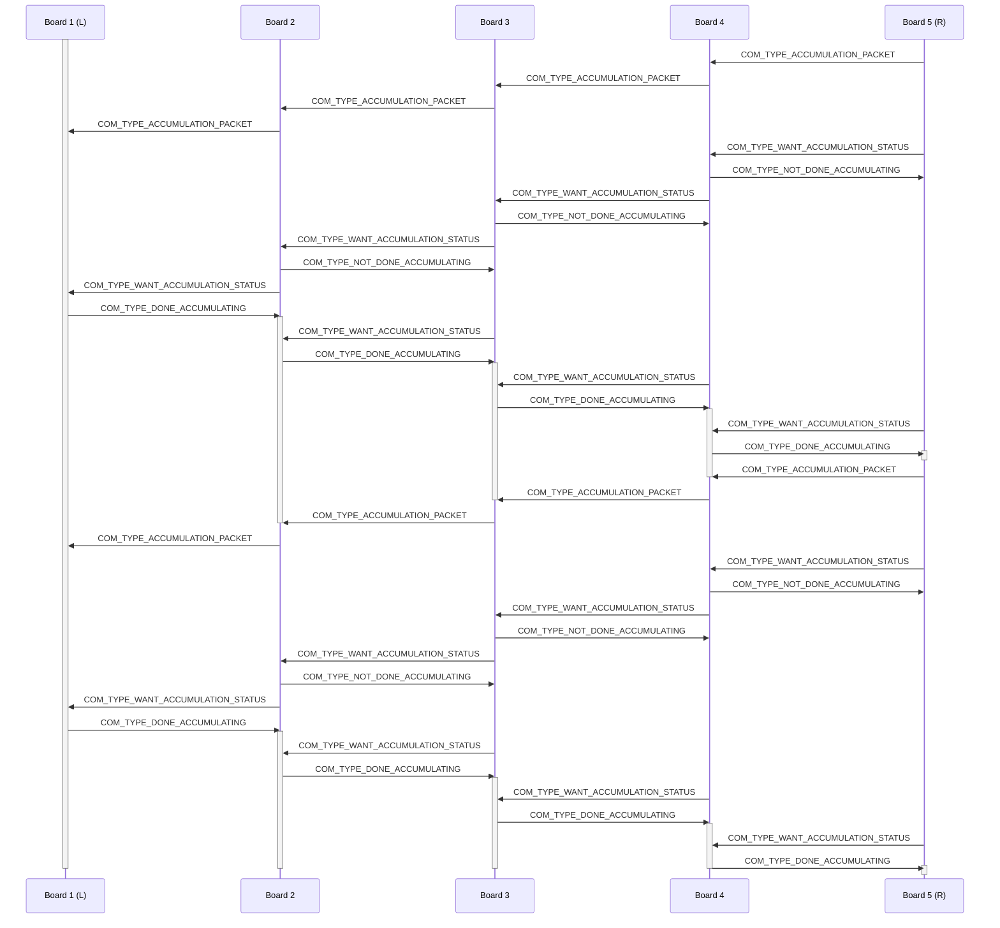

# Slab Firmware

[](https://nixos.org) [](https://xcfile.dev) 

The full firmware and downloads for the [Slab keyboard project](https://github.com/headblockhead/slab).

Downloads are in the releases section.

## Building

This project uses [Nix](https://nixos.org), run `nix develop` for a development environment, and `nix build` to build the firmware.

## Tasks

> [!IMPORTANT]
> You must be in the `nix develop` shell for these tasks to work!

### upload
Directory: ./build
Requires: build

Builds and uploads the firmware to the RP2040.

```bash
export PICO_DIR=`findmnt -S LABEL=RPI-RP2 -o TARGET -fn`
cp ./slab.uf2 $PICO_DIR
```

### upload-dbg
Directory: ./build
Requires: build-dbg

Builds and uploads debug firmware to the RP2040.

```bash
export PICO_DIR=`findmnt -S LABEL=RPI-RP2 -o TARGET -fn`
cp ./slab.uf2 $PICO_DIR
```

### build
Directory: ./build

```bash
cmake -DCMAKE_BUILD_TYPE=Release ..
cmake --build . -j $(nproc)
```

### build-dbg
Directory: ./build

Builds the keyboard firmware with development outputs.

```bash
cmake -DCMAKE_BUILD_TYPE=Debug .. 
cmake --build . -j $(nproc)
cp compile_commands.json ../ # Copies the autocomplete information for ccls.
```

### clean

Deletes the contents of the build directory.

```bash
rm -rf ./build
mkdir build
```

### fetch-submodules

Fetches submodules if not already present.

```bash
git submodule update --init --recursive
```

## Technical Details

### Communication between devices

Devices communicate using I²C, but not in the typical way of all devices sharing the same bus.

For each device, I²C bus 1 is set to act as a master that controlls all on-board slaves (OLED screens, etc.), and can control another connected keyboard slave.
I²C bus 2 is set to act as a slave, controlled by the bus 1 (master) of another board.

Boards are chained together, with each board's I²C bus 1 connected to the next board's I²C bus 2, in sequence.

#### Packets

Packets are made of 1 `packet_type` byte, followed by the appropriate amount of bytes for that `packet_type`.

##### Packet types:
- `COM_TYPE_ALIVE` is 0 bytes, and is sent continuously to allow boards to know if the board that is controlling them is still alive.
- `COM_TYPE_ACCUMULATION_PACKET` is 11 bytes, and contains all the SQUIRREL data, to be accumulated as it travels through the keyboard from right to left.
- `COM_TYPE_WANT_ACCUMULATION_STATUS` is 0 bytes and is sent continuously until `COM_TYPE_DONE_ACCUMULATING` is recieved as a response.
- `COM_TYPE_NOT_DONE_ACCUMULATING` is 11 bytes, all ignored.
- `COM_TYPE_DONE_ACCUMULATING` is 11 bytes, containing the SQUIRREL data, as accumulated, from the leftmost board.

#### Sequence Diagram


